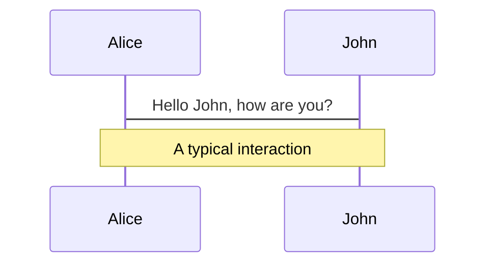
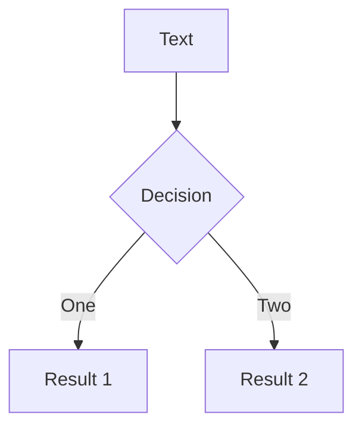
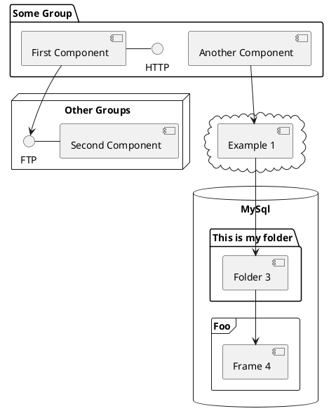

<!---------------------------- SLIDE 1 ----------------------------->


<div class="m-16 font-black text-center text-6xl">Corso avanzato</div>

<p class="flex items-center justify-center">
  <span class="m-2">Fabrizio Rizzi e</span>
  
</p>
---

<!---------------------------- SLIDE 2 ----------------------------->

# About me

<div class="text-center text-3xl">Ciao, mi chiamo Fabrizio e sono uno sviluppatore web, specializzato in tecnologie front-end.</div>
<br />
<div class="text-center text-3xl leading-relaxed mb-12">Sorintian dal 2017.</div>

<div class="relative w-100px h-110px m-auto">
  <div id="head" class="head"></div>
  <div class="ear-left">
    <div class="inner-ear"></div>
  </div>
  <div class="ear-right">
    <div class="inner-ear"></div>
  </div>
  <div class="eye-left">
    <div id="pupil-left" class="pupil"></div>
  </div>
  <div class="eye-right">
    <div id="pupil-right" class="pupil"></div>
  </div>
  <div class="nose"></div>
  <div class="hair"></div>
  <div class="hair-hover"></div>
  <div class="beard"></div>
  <div class="mouth"></div>
</div>

<!--
Mi occuppo di IT da pù di 10 anni, 2009 laurea in economia che strizza l'occhio all'informatica. Usato tecnologie web sia per front-end che back-end. Lavoro principalmente con Angular.
-->

---

<!---------------------------- SLIDE 3 ----------------------------->

# Programma del corso

- Oggetti e Prototype
- Array e metodi per l’iterazione
- Principali novità introdotte con ES6
- Javascript asincrono: Callback, Promise e Async / Await
- AJAX: connettersi a servizi remoti (XMLHttpRequest e Fetch API)
- Moduli: dividiamo il codice in più files
- Node, NPM e introduzione ai framework JS
---

<!---------------------------- SLIDE 4 ----------------------------->

# Veloce ripasso

 <div class="flex justify-around mb-12 text-center">
   <div>
     <h2>Primitive data types</h2>
     <ul>
       <li class="list-none">Boolean</li>
       <li class="list-none">Null</li>
       <li class="list-none">Undefined</li>
       <li class="list-none">Number</li>
       <li class="list-none">BigInt</li>
       <li class="list-none">String</li>
       <li class="list-none">Symbol</li>
     </ul>
   </div>
   <div>
     <h2>Reference data types</h2>
     <ul >
       <li class="list-none">Objects</li>
       <li class="list-none">Arrays</li>
       <li class="list-none">Functions</li>
       <li class="list-none">Dates</li>
     </ul>
   </div>
 </div>
 <div>
  <p class="text-center">MDN JavaScript data types and data structures</p>
  <p class="text-center">
    <a href="https://developer.mozilla.org/en-US/docs/Web/JavaScript/Data_structures">
      https://developer.mozilla.org/en-US/docs/Web/JavaScript/Data_structures
    </a>
  </p>
 </div>
---

<!------------------------------- SLIDE 5 ------------------------------>

# typeof

L'operatore typeof ritorna una stringa che indica il tipo dell'operando.

```js
console.log(typeof 42);
// expected output: "number"

console.log(typeof 'blubber');
// expected output: "string"

console.log(typeof true);
// expected output: "boolean"

console.log(typeof undeclaredVariable);
// expected output: "undefined"
```

<br />

[https://developer.mozilla.org/en-US/docs/Web/JavaScript/Reference/Operators/typeof](https://developer.mozilla.org/en-US/docs/Web/JavaScript/Reference/Operators/typeof)

<!--
Playcode typeof

PS altri operatori javascript
aritmetici + * / - ++ --
logici && ||
confronto == ===
assegnazione =
-->

---

<!------------------------------- SLIDE 6 ------------------------------>

# Values VS. References

  Ogni volta che assegnamo un valore ad una variabile, viene creata una copia di quel valore.
  Quando creiamo un oggetto, al contrario, stiamo creando una referenza a quell'oggetto. Se a due variabili viene assegnata la stessa referenza, i cambiamenti all'oggetto si rifletteranno su entrambe le variabili.
  
  <div style="display: flex; justify-content: space-around; margin-bottom: 20px">
    
    
  </div>

<!--
If a primitive type is assigned to a variable, we can think of that variable as containing the primitive value.
When we assign these variables to other variables using =, we copy the value to the new variable. They are copied by value.

Variables that are assigned a non-primitive value are given a reference to that value. That reference points to the object’s location in memory. The variables don’t actually contain the value.

However, if you use the assignment operator for a reference value, it will not copy the value. Instead, both variables will reference the same object in the memory.
Playcode 2 values vs. references
-->

---

<!------------------------------- SLIDE 7 ------------------------------>

# Oggetti

## Creare un oggetto

### Object literal

```js
const person = {
  name: ['Bob', 'Smith'],
  introduceSelf: function() {
    console.log(`Hi! I'm ${this.name[0]}.`);
  }
}
```

### Constructor function

```js
function Person(name) {
  this.name = name;
  this.introduceSelf = function() {
    console.log(`Hi! I'm ${this.name}.`);
  }
}
const frankie = new Person('Frankie');
```

<!--
An object is a collection of related data and/or functionality.

It is considered good practice to name constructor functions with an upper-case first letter.

The this keyword refers to the current object the code is being written inside — so in this case this is equivalent to person. So why not just write person instead?

Well, when you only have to create a single object literal, it's not so useful. But if you create more than one, this enables you to use the same method definition for every object you create.

Note: The new keyword in front of any function turns function call into a constructor call.
-->

---

<!------------------------------- SLIDE 8 ------------------------------>

# Oggetti

## Accedere alle proprietà

### Dot Notation
```js
person.name
person.introduceSelf()

person.address?.city // Optional chaining
```


### Bracket Notation

```js
person['name']
person['introduceSelf']()

const nome = 'name';
person[nome];
```

https://developer.mozilla.org/en-US/docs/Learn/JavaScript/Objects/Basics

https://developer.mozilla.org/en-US/docs/Web/JavaScript/Reference/Operators/Optional_chaining

---

<!------------------------------- SLIDE 9 ------------------------------>

# Oggetti e prototype

The prototype is an object that is associated with every functions and objects by default in JavaScript, where function's prototype property is accessible and modifiable and object's prototype property (aka attribute) is not visible.

Prototypes are the mechanism by which JavaScript objects inherit features from one another.

Prototype property is basically an object (also known as Prototype object), where we can attach methods and properties in a prototype object, which enables all the other objects to inherit these methods and properties.

Javascript è un linguaggio orientato agli oggetti che è unico in quanto non dispone di classi. Utilizziamo invece funzioni per creare oggetti.

Tutte le funzioni hanno un prototipo, che tutti gli oggetti creati usando questa function erediteranno tutte le properties; ei methods.


<!--
The JavaScript prototype property also allows you to add new methods to objects constructors:
This is an object with one data property, city, and one method, greet(). If you type the object's name followed by a period into the console, like myObject., then the console will pop up a list of all the properties available to this object. You'll see that as well as city and greet, there are lots of other properties!

Playcode3 Objects aggiungere a mano esempio indirizzo con ? e prove di bracket notation e prove di aggiungere proprietà
-->

---

<!------------------------------- SLIDE 10 ------------------------------>

# Oggetti e Es6

Spread operator

https://www.javatpoint.com/es6-objects#:~:text=Objects%20are%20the%20collection%20of,or%20multiple%20values%20using%20objects.


https://www.javatpoint.com/es6-object-destructuring

---


<!------------------------------- SLIDE 11 ------------------------------>

# Copiare un'oggetto

## Shallow copy

Una copia bla bla

## Deep copy

Una copia bla bla
 copiare prototype
https://www.javascripttutorial.net/object/3-ways-to-copy-objects-in-javascript/


https://stackoverflow.com/questions/122102/what-is-the-most-efficient-way-to-deep-clone-an-object-in-javascript


https://stackoverflow.com/questions/728360/how-do-i-correctly-clone-a-javascript-object
https://lodash.com/

https://developer.mozilla.org/en-US/docs/Web/API/structuredClone

<!-- Fare esempio che clonando oggetto il valore non cambia -->

---

<!------------------------------- SLIDE  ------------------------------>

# JSON (JavaScript Object Notation)


---

<!------------------------------- SLIDE  ------------------------------>

# Funzioni e Es6 
https://www.javatpoint.com/es6-functions
default parameters
rest parameters

---

<!------------------------------- SLIDE  ------------------------------>

# Arrow function
Una arrow function è un'alternativa compatta alle tradizionali funzioni, ma non può essere utilizzata in tutte le situazioni. Sono funzioni anonime che non hanno un binding del this, e non dovrebbero essere utilizzate come metodi, oltre a non poter essere utilizzate come costruttore.

Differences & Limitations:

Does not have its own bindings to this or super, and should not be used as methods.
Does not have new.target keyword.
Not suitable for call, apply and bind methods, which generally rely on establishing a scope.
Can not be used as constructors.
Can not use yield, within its body.
```js
const somma = (x, y) => x + y;
```

(https://developer.mozilla.org/en-US/docs/Web/JavaScript/Reference/Functions/Arrow_functions?retiredLocale=it)[https://developer.mozilla.org/en-US/docs/Web/JavaScript/Reference/Functions/Arrow_functions?retiredLocale=it]

---

<!------------------------------- SLIDE  ------------------------------>

# Array e ES6

  https://www.javatpoint.com/es6-arrays

---

<!------------------------------- SLIDE  ------------------------------>

# Array destructuring

  spread operator

  https://www.javatpoint.com/es6-arrays

---


<!------------------------------- SLIDE  ------------------------------>

# Array.prototype.forEach()

---

<!------------------------------- SLIDE  ------------------------------>

# Array.prototype.map()

Il metodo map crea un nuovo array popolato con i valori ritornati dalla funzione passata come argomento. Questa funzione viene chiamata per ogni elemento dell'array originale.

```js
const map = [1, 2, 3, 4, 5].map((number) => number * 2);

console.log(map);
// [2, 4, 6, 8, 10]
```

---

<!------------------------------- SLIDE  ------------------------------>

# Array.prototype.filter()
Il metodo filter crea un nuovo array contenente tutti gli elementi che passano il test implementato nella funziona passata come argomento.

```js
const words = ['spray', 'limit', 'elite', 'exuberant', 'destruction', 'present'];

const result = words.filter(word => word.length > 6);

console.log(result);
// expected output: Array ["exuberant", "destruction", "present"]
```

<!-- https://jscodebox.com/challenge/4 -->

---

<!------------------------------- SLIDE ------------------------------>

# Array.prototype.reduce()
The reduce() method executes a user-supplied "reducer" callback function on each element of the array, in order, passing in the return value from the calculation on the preceding element. The final result of running the reducer across all elements of the array is a single value.

```js
const array1 = [1, 2, 3, 4];

// 0 + 1 + 2 + 3 + 4
const initialValue = 0;
const sumWithInitial = array1.reduce(
  (previousValue, currentValue) => previousValue + currentValue,
  initialValue
);

console.log(sumWithInitial);
// expected output: 10
```
<!-- 
https://www.codewars.com/kata/5715eaedb436cf5606000381/solutions/javascript
 -->

---

<!------------------------------- SLIDE  ------------------------------>

# Classes

https://www.javatpoint.com/es6-classes
  
---


<!------------------------------- SLIDE  ------------------------------>

# Maps

https://www.javatpoint.com/es6-map
  
---


<!------------------------------- SLIDE  ------------------------------>

# Sets

https://www.javatpoint.com/es6-set

<!-- Esempio rendere unique values dell'array -->

---


<!------------------------------- SLIDE ------------------------------>

# Asynchronous calls with XMLHttpRequest

<p>
  AJAX enables HTTP requests to be made not only during the load
  time of a web page but also anytime after a page initially
  loads. This allows adding dynamic behavior to a webpage. This is
  essential for giving a good user experience without reloading
  the webpage for transferring data to and from the web server.
  The XMLHttpRequest (XHR) web API provides the ability to make
  the actual asynchronous request and uses AJAX to handle the data
  from the request. The given code block is a basic example of how
  an HTTP GET request is made to the specified URL.
</p>

```js
const xhr = new XMLHttpRequest();

xhr.open("GET", "mysite.com/api/getjson");
```

---

# Navigation

Hover on the bottom-left corner to see the navigation's controls panel, [learn more](https://sli.dev/guide/navigation.html)

### Keyboard Shortcuts

|                                                    |                             |
| -------------------------------------------------- | --------------------------- |
| <kbd>right</kbd> / <kbd>space</kbd>                | next animation or slide     |
| <kbd>left</kbd> / <kbd>shift</kbd><kbd>space</kbd> | previous animation or slide |
| <kbd>up</kbd>                                      | previous slide              |
| <kbd>down</kbd>                                    | next slide                  |

<!-- https://sli.dev/guide/animations.html#click-animations -->


<p v-after class="absolute bottom-23 left-45 opacity-30 transform -rotate-10">Here!</p>

---

layout: image-right
image: https://source.unsplash.com/collection/94734566/1920x1080

---

# Code

Use code snippets and get the highlighting directly![^1]

```ts {all|2|1-6|9|all}
interface User {
  id: number;
  firstName: string;
  lastName: string;
  role: string;
}

function updateUser(id: number, update: User) {
  const user = getUser(id);
  const newUser = { ...user, ...update };
  saveUser(id, newUser);
}
```

<arrow v-click="3" x1="400" y1="420" x2="230" y2="330" color="#564" width="3" arrowSize="1" />

[^1]: [Learn More](https://sli.dev/guide/syntax.html#line-highlighting)

<style>
.footnotes-sep {
  @apply mt-20 opacity-10;
}
.footnotes {
  @apply text-sm opacity-75;
}
.footnote-backref {
  display: none;
}
</style>

---

# Components

<div grid="~ cols-2 gap-4">
<div>

You can use Vue components directly inside your slides.

We have provided a few built-in components like `<Tweet/>` and `<Youtube/>` that you can use directly. And adding your custom components is also super easy.

```html
<Counter :count="10" />
```

<!-- ./components/Counter.vue -->
<Counter :count="10" m="t-4" />

Check out [the guides](https://sli.dev/builtin/components.html) for more.

</div>
<div>

```html
<Tweet id="1390115482657726468" />
```

<Tweet id="1390115482657726468" scale="0.65" />

</div>
</div>

---

## class: px-20

# Themes

Slidev comes with powerful theming support. Themes can provide styles, layouts, components, or even configurations for tools. Switching between themes by just **one edit** in your frontmatter:

<div grid="~ cols-2 gap-2" m="-t-2">

```yaml
---
theme: default
---
```

```yaml
---
theme: seriph
---
```


</div>

Read more about [How to use a theme](https://sli.dev/themes/use.html) and
check out the [Awesome Themes Gallery](https://sli.dev/themes/gallery.html).

---

## preload: false

# Animations

Animations are powered by [@vueuse/motion](https://motion.vueuse.org/).

```html
<div v-motion :initial="{ x: -80 }" :enter="{ x: 0 }">Slidev</div>
```

<div class="w-60 relative mt-6">
  <div class="relative w-40 h-40">
    
    
    
  </div>

  <div
    class="text-5xl absolute top-14 left-40 text-[#2B90B6] -z-1"
    v-motion
    :initial="{ x: -80, opacity: 0}"
    :enter="{ x: 0, opacity: 1, transition: { delay: 2000, duration: 1000 } }">
    Slidev
  </div>
</div>

<!-- vue script setup scripts can be directly used in markdown, and will only affects current page -->
<script setup lang="ts">
const final = {
  x: 0,
  y: 0,
  rotate: 0,
  scale: 1,
  transition: {
    type: 'spring',
    damping: 10,
    stiffness: 20,
    mass: 2
  }
}
</script>

<div
  v-motion
  :initial="{ x:35, y: 40, opacity: 0}"
  :enter="{ y: 0, opacity: 1, transition: { delay: 3500 } }">

[Learn More](https://sli.dev/guide/animations.html#motion)

</div>

---

# LaTeX

LaTeX is supported out-of-box powered by [KaTeX](https://katex.org/).

<br>

Inline $\sqrt{3x-1}+(1+x)^2$

Block

$$
\begin{array}{c}

\nabla \times \vec{\mathbf{B}} -\, \frac1c\, \frac{\partial\vec{\mathbf{E}}}{\partial t} &
= \frac{4\pi}{c}\vec{\mathbf{j}}    \nabla \cdot \vec{\mathbf{E}} & = 4 \pi \rho \\

\nabla \times \vec{\mathbf{E}}\, +\, \frac1c\, \frac{\partial\vec{\mathbf{B}}}{\partial t} & = \vec{\mathbf{0}} \\

\nabla \cdot \vec{\mathbf{B}} & = 0

\end{array}
$$

<br>

[Learn more](https://sli.dev/guide/syntax#latex)

---

# Diagrams

You can create diagrams / graphs from textual descriptions, directly in your Markdown.

<div class="grid grid-cols-3 gap-10 pt-4 -mb-6">







</div>

[Learn More](https://sli.dev/guide/syntax.html#diagrams)

---

layout: center
class: text-center

---

# Learn More

[Documentations](https://sli.dev) · [GitHub](https://github.com/slidevjs/slidev) · [Showcases](https://sli.dev/showcases.html)
